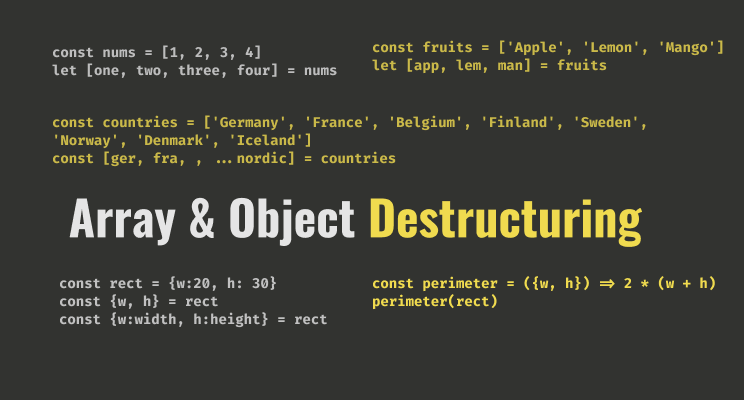

<div align="center">
  <h1> Destructuring in JavaScript</h1>
  <a class="header-badge" target="_blank" href="https://www.linkedin.com/in/asabeneh/">
  
  </a>
  <a class="header-badge" target="_blank" href="https://twitter.com/Asabeneh">
  
  </a>  <br>
  <sub>Author:
  <a href="https://www.linkedin.com/in/asabeneh/" target="_blank">Asabeneh Yetayeh</a>
  </sub>
</div>
</div>

<div>
</div>



- [Destructuring in JavaScript](#destructuring-in-javascript)
  - [What is Destructuring?](#what-is-destructuring)
  - [What can we destructure?](#what-can-we-destructure)
    - [1. Destructuring arrays](#1-destructuring-arrays)
    - [2. Destructuring objects](#2-destructuring-objects)
  - [Exercise](#exercise)
  - [More Materials](#more-materials)

# Destructuring in JavaScript

## What is Destructuring?

Destructuring is a way to unpack arrays, and objects and assigning to a distinct variable. Destructuring allows us to write clean and readable code.

## What can we destructure?

1. Arrays
2. Objects

### 1. Destructuring arrays

Arrays are a list of different data types ordered by their index. Let's see an example of arrays:

```js
const numbers = [1, 2, 3]
const countries = ['Finland', 'Sweden', 'Norway']
```

We can access an item from an array using a certain index by iterating through the loop or manually as shown in the example below.

Accessing array items using a loop

```js
for (const number of numbers) {
console.log(number)
}

for (const country of countries){
console.log(country)
}
```

Accessing array items manually

```js
const numbers = [1, 2, 3]
let num1 = numbers[0]
let num2 = numbers[1]
let num3 = numbers[2]
console.log(num1, num2, num3) // 1, 2, 3

const countries = ['Finland', 'Sweden', 'Norway']
let fin = countries[0]
let swe = countries[1]
let nor = countries[2]
console.log(fin, swe, nor)  // Finland, Sweden, Norway
```

Most of the time the size of an array is big and we use a loop to iterate through each item of the arrays. Sometimes, we may have short arrays. If the array size is very short it is ok to access the items manually as shown above but today we will see a better way to access the array item which is destructuring.

Accessing array items using destructuring

```js
const numbers = [1, 2, 3]
const [num1, num2, num3] = numbers
console.log(num1, num2, num3) // 1, 2, 3,

const constants = [2.72, 3.14, 9.81,37, 100]
const [e, pi, gravity, bodyTemp, boilingTemp] = constants
console.log(e, pi, gravity, bodyTemp, boilingTemp] 
// 2.72, 3.14, 9.81, 37,100
const countries = ['Finland', 'Sweden', 'Norway']
const [fin, swe, nor] = countries
console.log(fin, swe, nor) // Finland, Sweden, Norway
```

During destructuring each variable should match with the index of the desired item in the array. For instance, the variable fin matches to index 0 and the variable nor matches to index 2. What would be the value of den if you have a variable den next nor?

```js
const [fin, swe, nor, den] = countries
console.log(den) // undefined 
```

If you tried the above task you confirmed that the value is undefined. Actually, we can pass a default value to the variable, and if the value of that specific index is undefined the default value will be used.

```js
const countries = ['Finland', 'Sweden', undefined, 'Norway']
const [fin, swe, ice = 'Iceland',nor, den='Denmark'] = countries
console.log(fin, swe, ice, nor, den) // Finland, Sweden, Iceland, Norway, Denmark
```

Destructuring Nested arrays

```js
const fullStack = [
  ['HTML', 'CSS', 'JS', 'React'],
  ['Node', 'Express', 'MongoDB']
]

const [frontEnd, backEnd] = fullstack
console.log(frontEnd, backEnd) 

//["HTML", "CSS", "JS", "React"] , ["Node", "Express", "MongoDB"]

const fruitsAndVegetables = [['banana', 'orange', 'mango', 'lemon'],  ['Tomato', 'Potato', 'Cabbage', 'Onion', 'Carrot']]

const [fruits, vegetables] = fruitsAndVegetables
console.log(fruits, vegetables]

//['banana', 'orange', 'mango', 'lemon']
  
//['Tomato', 'Potato', 'Cabbage', 'Onion', 'Carrot']
```

Skipping an Item during destructuring

During destructuring if we are not interested in every item, we can omit a certain item by putting a comma at that index. Let's get only Finland, Iceland, and Denmark from the array. See the example below for more clarity:

```js
const countries = ['Finland', 'Sweden', 'Iceland', 'Norway','Denmark']
const [fin,,ice,,den] = countries
console.log(fin, ice, den) // Finland, Iceland, Denmark
```

Getting the rest of the array using the spread operator
We use three dots(...) to spread or get the rest of an array during destructuring

```js
const nums = [1, 2, 3, 4, 5, 6, 7, 8, 9, 10]
const [num1, num2, num3, ...rest] = nums
console.log(num1, num2, num3, rest) //1, 2, 3, [4, 5, 6, 7, 8, 9, 10]

const countries = [
  'Germany',
  'France',
  'Belgium',
  'Finland',
  'Sweden',
  'Norway',
  'Denmark',
  'Iceland'
]

let [gem, fra, , ...nordicCountries] = countries
console.log(gem, fra, nordicCountries) 
// Germany, France,  ["Finland", "Sweden", "Norway", "Denmark", "Iceland"]
```

There many cases in which we use array destructuring, let's see the following example:

Destructuring when we loop through arrays

```js
const countries = [['Finland', 'Helsinki'], ['Sweden', 'Stockholm'], ['Norway', 'Oslo']]

for (const [country, city] of countries) {
console.log(country, city)
}


const fullStack = [
  ['HTML', 'CSS', 'JS', 'React'],
  ['Node', 'Express', 'MongoDB']
]

for(const [first, second, third, fourth] of fullStack) {
console.log(first, second, third, fourt)
}

```

What do you think about the code snippet below? If you have started React Hooks already it may remind you of the useState hook.

```js
const [x, y] = [2, (value) => value ** 2]
```

What is the value of x? And what is the value of y(x)? I leave this for you to figure out.

If you have used react hooks you are very familiar with this and as you may imagine it is destructuring. The initial value of count is 0 and the setCount is a method that changes the value of count.

```js
const [count, setCount] = useState(0)
```

Now, you know how to destructure arrays. Let's move on to destructuring objects.

### 2. Destructuring objects

An object literal is made of key and value pairs. A very simple example of an object:

```js
const rectangle = {
width: 20,
height: 10
}
```

We access the value of an object using the following methods:

```js
const rectangle = {
width: 20,
height: 10
}

let width = rectangle.width
let height = recangle.height

// or

let width = rectangle[width]
let height = recangle[height]
```

But today, we will see how to access the value of an object using destructuring.

When we destructure an object the name of the variable should be exactly the same as the key or property of the object. See the example below.

```js
const rectangle = {
width: 20,
height: 10

}

let {width, height} = rectangle
console.log(width, height, perimeter) // 20, 10
```

What will be the value of we try to access a key which not in the object.

```js
const rectangle = {
width: 20,
height: 10,
}

let {width, height, perimeter} = rectangleconsole.log(width, height, perimeter) // 20, 10, undefined
```

The value of the perimeter in the above example is undefined.

Default value during object destructuring

Similar to the array, we can also use a default value in object destructuring.

```js
const rectangle = {
width: 20,
height: 10,
}


let {width, height, perimeter = 200} = rectangle
console.log(width, height, perimeter) // 20, 10, undefined
```

Renaming variable names

```js
const rectangle = {
width: 20,
height: 10,
}

let {width:w, height:h} = rectangle
```

Let's also destructure, nested objects. In the example below, we have nested objects and we can destructure it in two ways.

We can just destructure step by step

```js
const props = {
  user:{
    firstName:'Asabeneh',
    lastName:'Yetayeh',
    age:250
  },
  post:{
    title:'Destructuring and Spread',
    subtitle:'ES6',
    year:2020
},
skills:['JS', 'React', 'Redux', 'Node', 'Python']
  
}
}

const {user, post, skills} = props
const {firstName, lastName, age} = user
const {title, subtitle, year} = post
const [skillOne, skillTwo, skillThree, skillFour, skillFive] = skills
```

1. We can destructure it one step

```js
const props = {
  user:{
    firstName:'Asabeneh',
    lastName:'Yetayeh',
    age:250
  },
  post:{
    title:'Destructuring and Spread',
    subtitle:'ES6',
    year:2020
},
skills:['JS', 'React', 'Redux', 'Node', 'Python']
  
}

}

const {user:{firstName, lastName, age}, post:{title, subtitle, year}, skills:[skillOne, skillTwo, skillThree, skillFour, skillFive]} = props

```

Destructuring during loop through an array

```js
const languages = [
  { lang: 'English', count: 91 },
  { lang: 'French', count: 45 },
  { lang: 'Arabic', count: 25 },
  { lang: 'Spanish', count: 24 },
  { lang: 'Russian', count: 9 },
  { lang: 'Portuguese', count: 9 },
  { lang: 'Dutch', count: 8 },
  { lang: 'German', count: 7 },
  { lang: 'Chinese', count: 5 },
  { lang: 'Swahili', count: 4 },
  { lang: 'Serbian', count: 4 }
]


for (const {lang, count} of languages) {
  console.log(`The ${lang} is spoken in ${count} countries.`)
}
```

Destructuring function parameter

```js
const rectangle = {width: 20, height:10}
const calcualteArea = ({width, height}) => width * height
const calculatePerimeter = ({width, height}) = 2 * (width + height)
```

## Exercise

Create a function called getPersonInfo. The getPersonInfo function takes an object parameter. The structure of the object and the output of the function is given below. Try to use both a regular way and destructuring and compare the cleanness of the code. If you want to compare your solution with my solution, check this link.

```js
const person = {
  firstName: 'Asabeneh',
  lastName: 'Yetayeh',
  age: 250,
  country: 'Finland',
  job: 'Instructor and Developer',
  skills: [
    'HTML',
    'CSS',
    'JavaScript',
    'React',
    'Redux',
    'Node',
    'MongoDB',
    'Python',
    'D3.js'
  ],
languages: ['Amharic', 'English', 'Suomi(Finnish)']

};
  
/*
Asabeneh Yetayeh lives in Finland. He is  250 years old. He is an Instructor and Developer. He teaches HTML, CSS, JavaScript, React, Redux, Node, MongoDB, Python and D3.js. He speaks Amharic, English and a little bit of Suomi(Finnish)
*/
```

## More Materials

For more JavaScript and other programming lessons and tutorials, you may check <a href="https://www.youtube.com/channel/UC7PNRuno1rzYPb1xLa4yktw">Washera</a> YouTube channel. 

If you want to dive deep into JavaScript, you can give it a try to the [30DaysOfJavaScript](https://github.com/Asabeneh/30DaysOfJavaScript) challenge. This challenge will take quite long time to finish but you can get all you need about JavaScript

JavaScript  

1. [30DaysJavaScript challenge](https://github.com/Asabeneh/30DaysOfJavaScript)
2. [JavaScript for Everyone](https://github.com/Asabeneh/JavaScript-for-Everyone)
3. [JavaScript Loops](https://github.com/Asabeneh/JavaScript-Loops)
4. [Functional programming in JavaScript](https://github.com/Asabeneh/Functional-Programming-in-JavaScript)

React  

1. [React for Everyone](https://github.com/Asabeneh/React-For-Everyone)

Python  

1. [30DaysOfPython](https://github.com/Asabeneh/30-Days-Of-Python)

🎉 CONGRATULATIONS 🎉  
Now, you know everything you need to know about Destructuring and I will write more about the spread operator in the coming article.
